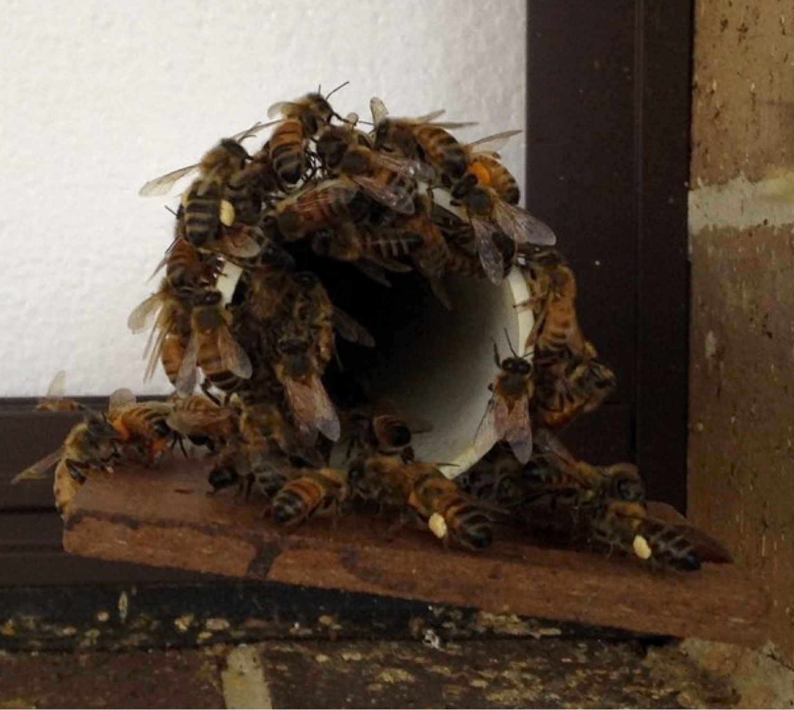

# Machine Learning Workshop

## Focus

The aim of this project is to produce open source workshop materials which can be used to teach scientists how to use machine learning as a tool to assist them with their research.

## Workshop Structure

1. [Introducing machine learning](intro.md)
2. [Workshop dataset](dataset.md)
3. [Image and feature analysis](images_features.ipynb)
4. [Building a machine learning program](training_testing.ipynb)

## Learning Objectives

The aim of this workshop is to provide participants with the following skills:

* Reading images into Python
* Basic image processing
* Feature engineering skills
* Organising large datasets
* Splitting your dataset into training and testing sets
* Clustering your data
* Training a support vector machine classification program
* Testing the accuracy of your predictions.

## Dataset

The data used for this workshop come in the form of images of tags on the backs of honeybees which were filmed as part of an experiment into bee behaviour. We are interested in training a machine learning algorithm to automatically classify the different types of tag automatically. More information is available in the [workshop dataset](dataset.md) section of the workshop materials.

## Requirements

These lessons have been written with a certain type of learner in mind. They assume you are comfortable with writing and using Python code. They also assume a general understanding of statistical concepts. Nothing too esoteric but you should have a working knowledge of regression and significance.

The following software is required:

* Python 3+
* NumPy
* OpenCV
* scikit-learn
