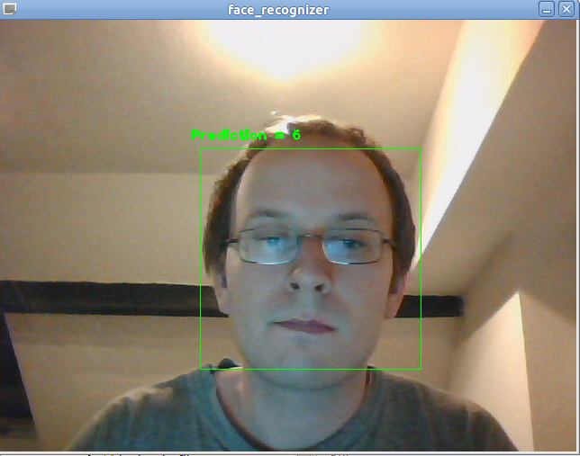

# A brief introduction to machine learning

## What is machine learning?

Traditionally, programming has involved writing code as a series of formal steps the program should take when trying to achieve a certain goal. The problem with this is that when you have a large and complicated dataset, it can be extremely difficult to describe the rules the program should use to solve your problem.

This is where machine learning comes into play. Machine learning allows you to write a program that learns and looks for patterns within the data you expose it to. You can then give it new data and allow it to make predictions and classifications based on the previous examples you have shown it.

There are two main types of machine learning:

### Supervised
Supervised learning occurs when you have a dataset and a set of labels describing the data that you can train the computer with.

The picture above is an example of this type of learning. Face recognition involves training the computer on thousands of images where you have told it what images have faces in them, and what images do not.

### Unsupervised
Unsupervised learning occurs when you have a dataset without any labels and you wish to look at the patterns within the data.

Even when you do have labelled data, unsupervised learning can be a useful first step for when you want to visualise your dataset.
